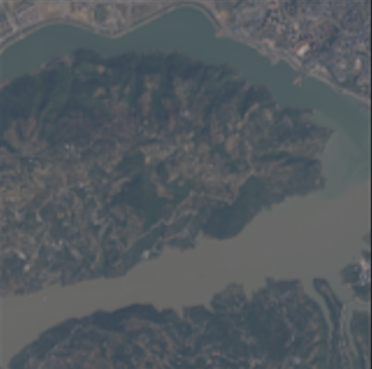
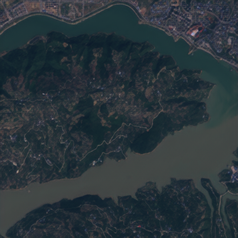
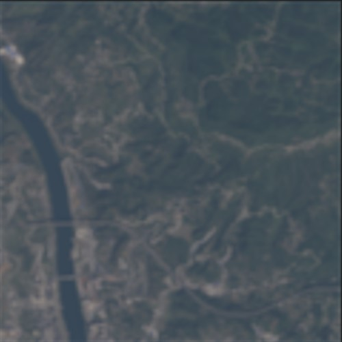

# RealESRGAN-OLI2MSI

This repository contains a PyTorch implementation of a satellite imagery super-resolution model based on the Real-ESRGAN architecture. It is specifically tailored for enhancing low-resolution remote sensing images from the OLI2MSI dataset.

While generic ESRGAN models are effective for standard photography, satellite imagery requires handling specific spectral bands and consistent normalization. This project adapts the RRDB-based generator and pairs it with a U-Net discriminator featuring Spectral Normalization to improve training stability and reconstruction quality for satellite data.

The model targets a 4x upscaling factor.

## Table of Contents
- [Architecture](#architecture)
- [Dataset](#dataset)
- [Installation](#installation)
- [Usage](#usage)
  - [Training](#training)
  - [Testing](#testing)
- [Results](#results)
- [Acknowledgements](#acknowledgements)

## Architecture

The framework is composed of two main networks trained in an adversarial setting:

**Generator (`GeneratorRRDB`)**
- 32 Residual-in-Residual Dense Blocks (RRDB) for deep feature extraction.
- Squeeze-and-Excitation (SE) attention layers integrated within the blocks.
- PixelShuffle upsampling for a 4x spatial resolution increase.

**Discriminator (`UNetDiscriminatorSN`)**
- U-Net style architecture with skip connections for local and global context consistency.
- Spectral Normalization applied to stabilize the adversarial training process.

The total objective function combines an L1 pixel loss, a VGG19-based perceptual loss, and the adversarial loss.

## Dataset

This implementation expects paired high-resolution (HR) and low-resolution (LR) images, specifically formatted from the [OLI2MSI dataset](https://www.kaggle.com/datasets/nexuswho/oli2msi).

### Directory Structure

Images should be in `.TIF` format for training and must have matching filenames across both directories.

```text
dataset/
├── LR/
│   ├── image001.TIF
│   └── image002.TIF
└── HR/
    ├── image001.TIF
    └── image002.TIF
```

## Installation

Clone the repository and install the dependencies. It is recommended to use a virtual environment.

```bash
# Optional but recommended
python -m venv venv
source venv/bin/activate  # On Windows use: venv\Scripts\activate

# Install requirements
pip install -r requirements.txt
```

Core dependencies include PyTorch, TorchVision, Rasterio, and scikit-image.

## Usage

### Training

To train the model from scratch, execute the `train.py` script. The training process includes automatic train/validation splitting and PSNR-based early stopping.

```bash
python train.py \
    --lr_dir path/to/dataset/LR \
    --hr_dir path/to/dataset/HR \
    --n_epochs 200 \
    --batch_size 4
```

**Key Arguments:**
- `--lr_dir`, `--hr_dir`: Paths to the respective image directories.
- `--n_epochs`: Total number of training epochs.
- `--batch_size`: Batch size per GPU.
- `--lr`: Learning rate (defaults to 1e-4).
- `--val_split`: Fraction of data to use for validation.
- `--resume_checkpoint`: Path to an existing checkpoint to resume training.

Checkpoints are saved in the `saved_models/` directory, and validation samples are periodically output to `images/validation/`.

### Testing

To evaluate a trained model and generate super-resolved images:

```bash
python test.py \
    --weights_path saved_models/generator_best.pth \
    --lr_dir path/to/test/LR \
    --hr_dir path/to/test/HR \
    --output_dir results/
```

The evaluation script calculates the Peak Signal-to-Noise Ratio (PSNR) and Structural Similarity Index (SSIM) based on the provided ground truth HR images. Outputs will be saved as PNG files in the specified output directory.

## Results

Below are samples demonstrating the 4x upscaling capability on the OLI2MSI dataset. The model correctly recovers high-frequency spatial details from the LR inputs.

| Low Resolution (Input) | High Resolution (Output) |
| --- | --- |
|  |  |
|  |  |

## Acknowledgements

This work builds upon the foundational research of [ESRGAN](https://arxiv.org/abs/1809.00219) and [Real-ESRGAN](https://arxiv.org/abs/2107.10833). We also thank the creators of the OLI2MSI dataset for providing the data necessary to train satellite-specific super-resolution models.
